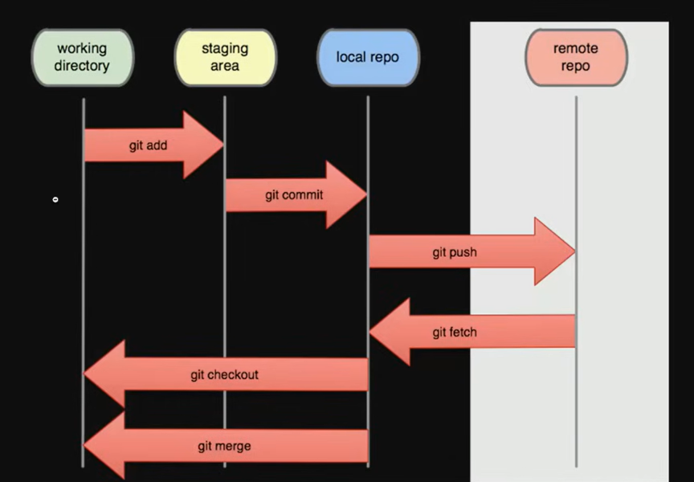

# Git Course With Elzeroo


<br>
### To Review Status

```bash
$ git status
```

### Add file from **Working_Dirictory** to **Staging Area**

```bash
$ git add README.md
```
### Remove file from file from **Staging Area** to **Working_Dirictory** 

```bash
$ git rm --cashed README.md
```

### from **Staging Area** to **Local Repo**

```bash
$ git commit -m "Create the main project stucture"
```
### Show all **Local Branches**

```bash
$ git branch
```